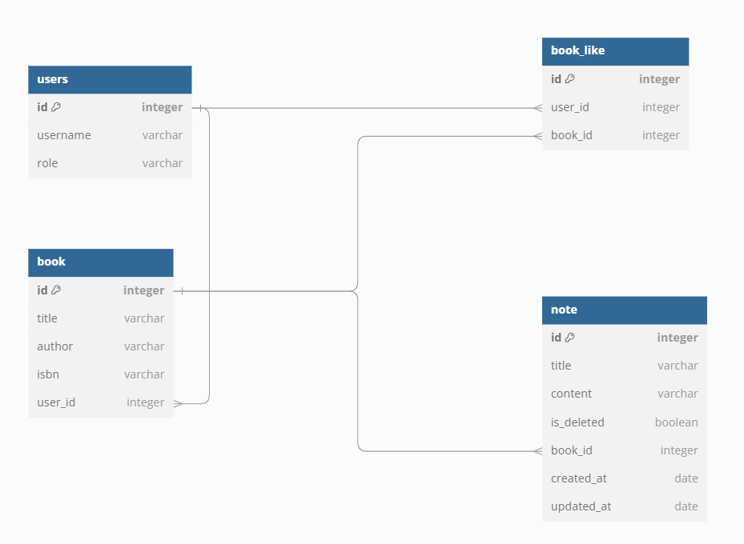
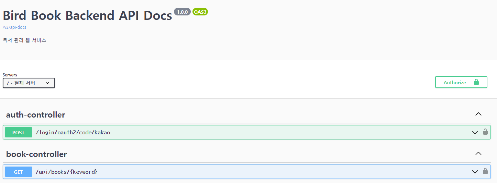
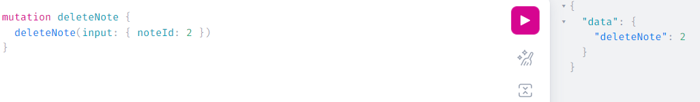
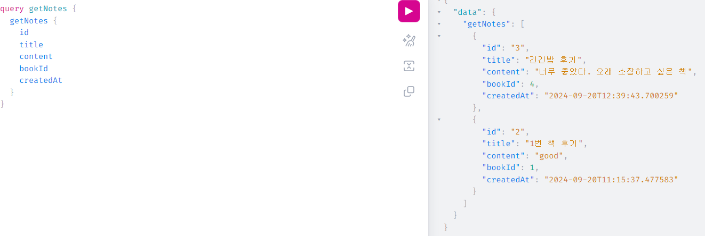
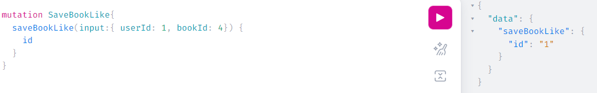

# birdbook-backend
###### 📘 독서 관리 백엔드 프로그램

### 📚 개요
Bird Book은 읽고 싶은 책을 검색하고, 개인적으로 소장하며, 감상을 기록하고 공유할 수 있는 웹 서비스 입니다.

Bird Book을 통해 새로운 책과 독서 경험을 발견해보세요 😊
### 📚 Skills
| 분류             | 기술                                                     |
|----------------|--------------------------------------------------------|
| **언어 및 프레임워크** | Java 17, Spring Boot 3.3.3                             |
| **DataBase**   | PostgreSQL                                             |
| **CI, Container**      | Github Actions, Docker, Docker compose|
| **라이브러리**      | Spring Data JPA, Lombok, Kakao Login, Naver Search API |
| **API 문서화**    | Swagger                                                |
| **Query**      | GraphQL                                                |

### 📚 테크스펙
<details>
<summary>Kakao 로그인</summary>
</details>
<details>
<summary>Naver API를 통한 책 검색</summary>
</details>
<details>
<summary>원하는 책 저장</summary>
</details>
<details>
<summary>저장한 책에 좋아요 누르기</summary>
</details>
<details>
<summary>저장한 책에 관한 노트 작성</summary>
</details>
<details>
<summary>작성한 노트 목록 조회</summary>
</details>
<details>
<summary>작성한 노트 삭제</summary>
</details>

### 📚 ERD


### 📚 Swagger UI


### 📚 GraphQL UI
<details>
<summary>책 저장</summary>


</details>


<details>
<summary>책 삭제</summary>



</details>

<details>
<summary>노트 작성</summary>


</details>

<details>
<summary>노트 목록 조회</summary>



</details>

<details>
<summary>좋아요</summary>



</details>

### 📚 실행 방법
###### 로컬 pc에 docker가 설치되어 실행되고 있음을 가정합니다.
1. 프로젝트를 clone 받습니다.
    ```shell
    git clone https://github.com/jooda00/birdbook-backend.git
    ```
2. terminal에서 밑의 명령어를 수행하여 빌드합니다.
    ```shell
    ./gradlew clean build
    ```
3. 빌드 후, docker 디렉토리로 이동하여 docker-compose.yml 파일을 실행합니다.
    ```shell
    cd docker # docker 패키지로 이동
    ```
    ```dockerfile
    docker compose up -d --build
    ```
